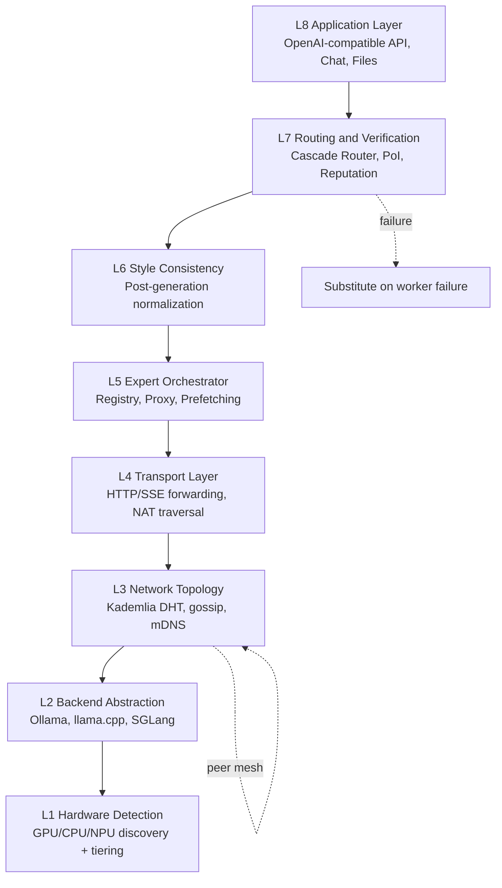

# Mycelium

> **Public companion to [`thornveil-ai/mycelium`](https://github.com/thornveil-ai/mycelium).** Distributed AI mesh. Substitute-on-failure inference across heterogeneous nodes. Customer-deployed.

[-blue)](LICENSE)
[-red)](#get-access)

A peer-to-peer mesh network that turns heterogeneous devices into nodes in a distributed AI inference system. Discovers peers via mDNS and DHT, routes inference by capability and load, and substitutes on worker failure so generation continues without operator action. Designed for DDIL environments where any individual node may drop and the workload must continue.

## What this repository is

This is the **public companion** to the proprietary Mycelium system. It contains:

- This README and the architecture overview
- Right-to-Integrate (R2I) alignment statement
- NIST 800-53 controls mapping
- OpenAPI specification for the chat-completions and mesh-status endpoints
- Threat model overview
- Architecture diagrams and design notes

It does **not** contain implementation source. The source lives in the proprietary `thornveil-ai/mycelium` repository under commercial licensing. Contact info is in [Get access](#get-access).

## Architecture

Eight-layer stack from hardware detection to OpenAI-compatible API. Coordinator at each node holds the routing table; failure of any expert triggers substitution so generation continues.

See [docs/ARCHITECTURE.md](docs/ARCHITECTURE.md) for the layer-by-layer walk-through.

## Right to Integrate (R2I) alignment

Mycelium is R2I-compliant by design:

- **Exposed APIs** — OpenAI-compatible `/v1/chat/completions` validated against the EXO Labs OSS client ecosystem; plus `/healthz`, `/mesh/status`, `/mesh/dashboard.json`, `/audit/verify`, `/v1/models`
- **Published documentation** — OpenAPI 3.1.0 spec, operator runbook overview, threat model overview, NIST 800-53 controls mapping, STIG-lite checklist
- **Vendor-neutral** — any OpenAI-compatible client connects without code changes
- **Modular Open Systems Architecture** — coordinator and workers cleanly separated; OpenAI surface independent of MoE backend; pluggable fallback model and tier ladder
- **Cryptographically auditable** — every chat completion HMAC-chained into a tamper-evident ledger; `GET /audit/verify` returns chain integrity
- **No vendor lock-in** — cosign-signed binaries on releases; reproducible build; SBOM included

See [docs/R2I-COMPLIANCE.md](docs/R2I-COMPLIANCE.md) for the full alignment evidence.

## Hardware tiers

| Tier | Profile | Indicative cost | Use case |
|---|---|---|---|
| Edge | RTX 4070 + 32 GB RAM | $1,500-3,000 | Single-operator workstation |
| Workstation | RTX 4090 / 5090 + 64 GB | $5,000-8,000 | Squad-level coordinator |
| Server | Multi-GPU (RTX PRO 6000 / A100 / H100) + 128 GB+ | $15,000+ | Section / company tier coordinator |
| Rugged tablet | NPU-class (Snapdragon X / Apple M-series) | $3,000-5,000 | Forward operator + fallback worker |

Mesh tiers are interoperable — a workstation coordinator can route expert calls to rugged tablets at the edge with substitute-on-failure.

## Get access

Mycelium is available under commercial license for federal procurement, defense primes, and authorized commercial deployments.

- **Federal / DoD procurement**: `federal@thornveil.ai`
- **Commercial licensing**: `licensing@thornveil.ai`
- **Evaluation access**: `jesse@thornveil.ai`
- **R2I integration**: `jesse@thornveil.ai` — Thornveil provides OpenAPI specs, sample clients, and a 30-day evaluation deployment on your infrastructure

## License

The artifacts in this repository (README, docs, OpenAPI specs, diagrams) are licensed under [Apache-2.0](LICENSE). The Mycelium implementation source lives at `thornveil-ai/mycelium` under separate proprietary licensing.

---

A Thornveil system. See [other Thornveil systems](https://github.com/thornveil-ai).
